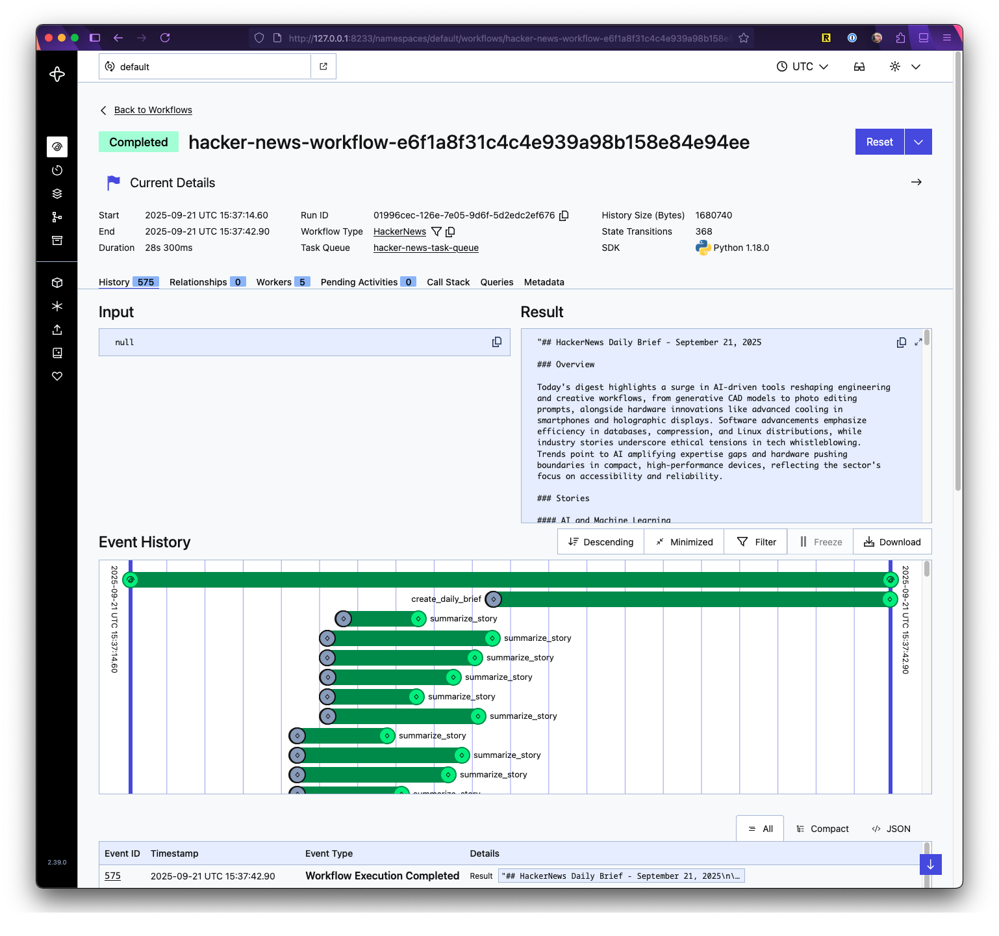

# HN Brief

Generate a daily brief of top Hacker News stories using LLMs.

This project demonstrates creating AI workflows with [Temporal](https://temporal.io/), an open-source platform for orchestrating reliable, durable workflows, and [POML](https://microsoft.github.io/poml/stable/), a format for constructing well-structured prompts for language models.

## Setup
- Install [mise](https://mise.jdx.dev/) to manage tools like UV and Python.
- Run `mise install` to set up UV and Python 3.13+.
- Install dependencies: `uv sync`.
- Use Docker to run the Temporal server: `docker-compose up`.

Note: Mise automatically loads environment variables from a `.env` file if one is present in the project root.

## Running
- **Local development:**
  - Start the Temporal worker: `uv run hnbrief-worker`.
  - Run the workflow: `uv run hnbrief --max-stories <number>` (1-500, default 35) to process stories and generate the brief.

- **With Docker:**
  - Start both Temporal server and worker: `docker-compose up`.
  - Run the workflow: `uv run hnbrief --max-stories <number>` (connects to Docker Temporal server).
  - Alternatively, use mise tasks for individual control:
    - Start Temporal server: `mise run docker:temporal:start`
    - Start worker: `mise run docker:worker:start`
    - Run CLI workflow in Docker: `mise run docker:cli:start`
    - Stop services: `mise run docker:temporal:stop` or `mise run docker:worker:stop`

## Project Management Tasks
Use mise for common development tasks:
- Lint code: `mise run lint`
- Format code: `mise run format`
- Type check: `mise run type-check`
- Run tests (includes lint, format, type-check): `mise run test`
- Build worker Docker image: `mise run docker:worker:build`

## Limitations
The application fetches and converts article content to Markdown for summarization. This may fail for some sites or non-web content like PDFs. Consider using a dedicated content extraction service for better reliability. Check response content type before parsing to handle different formats.
